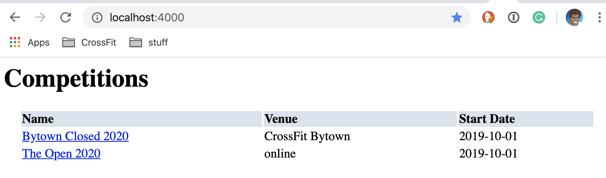
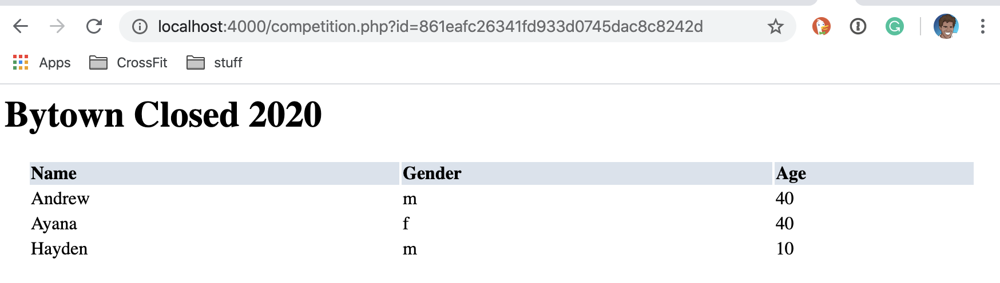
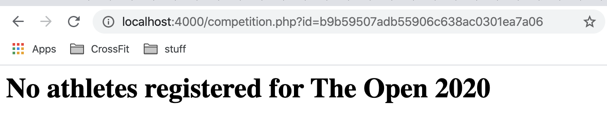

# Leader Board

## Sommaire

| Sommaire | Valeur |
| --- | --- |
| Cours | CSI 2532 |
| Date | Hiver 2021 |
| Professor | [Andrew Forward](aforward@uottawa.ca) |
| TA | Kalonji Kalala, hkalo081@uottawa.ca |
| TA | Lintian Wang, lwang263@uottawa.ca |
| Equipe | Andrew Forward 1484511<br>Ayana 9021000 |

## Livrables

* [Livrable 1 (5%) Hello-World](deliverable1.fr.md)

### Livrable 2 (5%) Application + DB

| Mark | Description | Commentaire |
| --- | --- | --- |
| 3.0 | Modèle ER | Voir ci-dessous |
| 3.0 | Modèle relationnel / schéma SQL | Les images ci-dessous, et [schema.sql](db/schema.sql) et [migrations](db/migrations) |
| 1.0 | Application (READ-ONLY) | Les instructions ci-dessous |
| 1.0 | SQL "seed" / exemples pour INSERT, UPDATE, SELECT, DELETE des données | Le [seed.sql](seed.sql) et les exemples ci-dessous |
| 1.0 | README.md contient toutes les informations requises | Voir _cette_ page |
| 1.0 | Utilisation de git (messages de commit, tous les étudiants impliqués) | Voir [les commits dans GitHub](https://github.com/professor-forward/leaderboard/commits/main) |
| / 10 | |


## Description de l'application

La base de données du leaderboard modéliser les athlètes (`athletes`), y compris
des détails tels que leur nom (`name`), leur date de naissance
(`date of birth`) et leur sexe (`gender`).

Le leaderboard inclus les `competitions`. Un compétition a un nom (`name`),
lieu (`venue`), les date (`start_date` et `end_date`).

Un `athlete` peut s'inscrire (`register`) à n'importe quelle compétition.

## Modèle ER

Le diagramme ER a été créé avec [Lucidchart](/lucidchart.md).


## Modèle relationnel

Le modèle relationnel (diagramme) a également été créé avec [Lucidchart](/lucidchart.md).


## Schéma SQL

Le [schèma SQL](db/schema.sql).

Il était testé avec [PostgreSQL](https://www.postgresql.org/).

Pour créer le base de donnée `leaderboard`, exécutez

```bash
psql -c "create database leaderboard"
```

Pour remplir le [schèma](db/schema.sql) pour le base de donnée, exécutez

```bash
psql -d leaderboard -f ./db/schema.sql
```

Si vous avez déjà une base de donnée, les migrations sont disponsible dans

```bash
db/migrations
```

Exécutez toutes les migrations (manquantes) en order de la date dans le
nom de fichier (e.x `YYYYMMDDhhmmss` of `20200205100000-create-athletes.sql`).

```sql
psql -d leaderboard -f ./db/migrations/20200205100000-create-athletes.sql
psql -d leaderboard -f ./db/migrations/20200206230000-create-migrations.sql
psql -d leaderboard -f ./db/migrations/20200206230001-update-athletes.sql
psql -d leaderboard -f ./db/migrations/20200206230002-create-competitions.sql
```

## Ajout de données ("seed")

Pour remplir le base de donnée avec le (seed.sql)

```bash
psql -d leaderboard -f ./db/seed.sql
```

## Web App (PHP)

Une application web a été développée pour se
connecter à notre base de données.

### Installation

#### PHP 7.3+

Pour exécuter ce projet, vous devez avoir PHP et un console pour les commandes.
Mon environnement (Mac OSX) est déjà fourni avec les deux.

Cela a été testé sur `PHP 7.3`

```bash
php --version
```

La sortie montre quelque chose de similaire à

```bash
PHP 7.3.9 (cli) (built: Nov  9 2019 08:08:13) ( NTS )
Copyright (c) 1997-2018 The PHP Group
Zend Engine v3.3.9, Copyright (c) 1998-2018 Zend Technologies
```

#### Postgres 11+

L'application se connecte à une base de données postgres.
Vous devrez l'installer localement.

Cela a été testé sur `PostgreSQL 11.5`

```bash
psql --version
```

The output should show something similar to

```bash
psql (PostgreSQL) 11.5
```


### Running

Pour démarrer le serveur PHP, exécutez le suivant à
la racine du projet.

```bash
(cd public && php -S localhost:4000)
```

La sortie doit ressembler à

```bash
Listening on http://localhost:4000
Document root is /Users/aforward/sin/projects/current/professor-forward/phpapp/public
Press Ctrl-C to quit.
```

Vous pouvez ouvrir dans un navigateur, votre application Web PHP.

[http://localhost:4000](http://localhost:4000)

La sortie doit ressembler à



Si vous cliquez sur une compétition, vous verrez les athlètes inscrits.



Ou, si aucun athlète n'est encore inscrit.



## Exemples SQL

Nous pouvons explorer le base de données sur la console postgres.

```bash
psql -d leaderboard
```

Trouvez tous les athlètes «F»

```sql
SELECT *
FROM athletes
WHERE gender = 'f';
```

Changez les noms de nos athlètes.

```sql
UPDATE athletes
SET name = concat(name, ' Forward');
```

Let's add a new athlete.

```sql
INSERT INTO athletes (name, gender, dob)
VALUES
('Kyle Krager', 'm', '1975-10-10');
```

Let's register him in the Bytown Closed.

```sql
INSERT INTO registrations (athlete_id, competition_id, age, gender)
SELECT
    (SELECT id FROM athletes WHERE name = 'Kyle Krager') AS athlete_id,
    (SELECT id FROM competitions WHERE name = 'Bytown Closed 2020') AS competition_id,
    45,
    'm';
```

Let's update the ages of `Andrew` and `Ayana` in the Bytown competition

```sql
UPDATE registrations
SET age = 41
WHERE athlete_id IN (
  SELECT id from athletes WHERE name in ('Andrew Forward', 'Ayana Forward'));
```

Let's view all athletes registered in the Bytown Closed 2020.

```sql
SELECT athletes.name,
       registrations.gender,
       registrations.age,
       competitions.name,
       competitions.venue
FROM registrations
INNER JOIN athletes ON athletes.id = registrations.athlete_id
INNER JOIN competitions ON competitions.id = registrations.competition_id
WHERE competitions.name = 'Bytown Closed 2020';
```

Let's delete all registrations.

```sql
DELETE FROM registrations;
```

And now the table is empty.

```sql
SELECT count(*)
FROM registrations;
```
