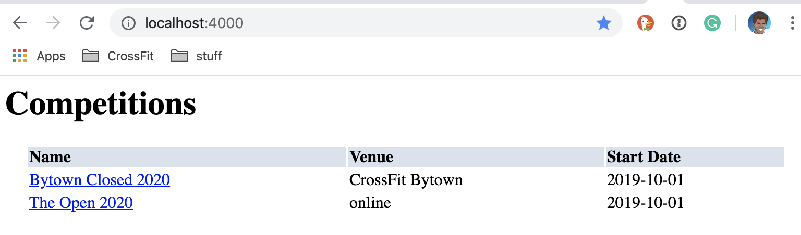
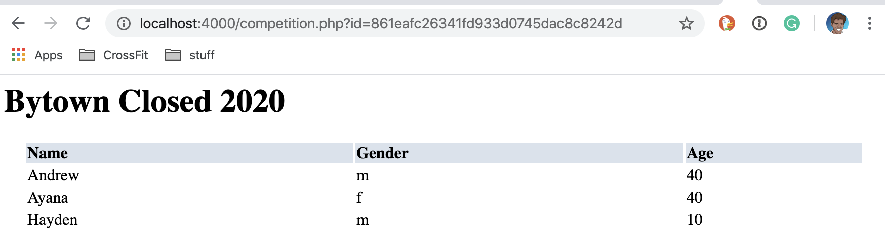
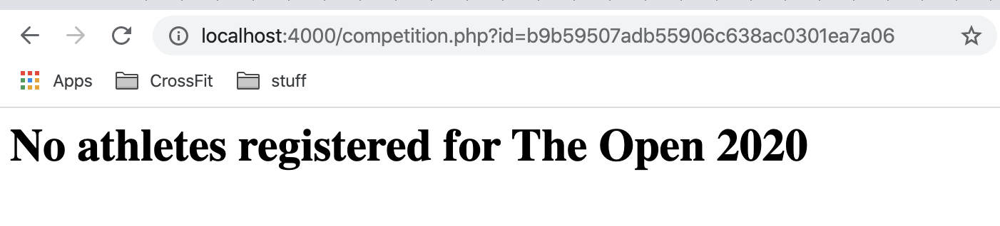

# Leader Board

## Outline

| Outline | Value |
| --- | --- |
| Course | CSI 2532 |
| Date | Winter 2021 |
| Professor | Andrew Forward, aforward@uottawa.ca |
| TA | Kalonji Kalala, hkalo081@uottawa.ca |
| TA | Lintian Wang, lwang263@uottawa.ca |
| Team | Andrew Forward 1484511<br>Ayana Forward 9021000 |

## Deliverables

* [Deliverable 1 (5%) Hello World](deliverable1.md)

### Deliverable 2 (5%) DB Backed Application

| Mark | Description | Comment |
| --- | --- | --- |
| 3.0 | ER model  | See below |
| 3.0 | Relational model / SQL schema | Les images ci-dessous Image below, et [schema.sql](db/schema.sql) and et [migrations](db/migrations) |
| 1.0 | Application (read-only) | Instructions below |
| 1.0 | SQL seed / examples to INSERT, UPDATE, SELECT and DELETE data | See below and seed.sql (link to come) |
| 1.0 | README.md contains all required information | See _this_ page |
| 1.0 | Git usage (commit messages, all students involved) | See [commit details in GitHub](https://github.com/professor-forward/leaderboard/commits/main)
| / 10 | |


## Application Description

The leaderboard database models an `athletes`, including
details such as their `name`, `date of birth`, and identified `gender`.

The leaderboard tracks `competitions`.  A competition has a `name`,
`venue`, a `start_date` and a `end_date`.

An `athlete` can `register` for any competition.


## ER Model

The ER diagram was created with [Lucidchart](/lucidchart.md).


## Relational Model

The Relational Model (diagram) was also created with [Lucidchart](/lucidchart.md).


## SQL Schema

The [SQL Schema is available here](db/schema.sql).

It was tested using [PostgreSQL](https://www.postgresql.org/).

To create the `leaderboard` database run

```bash
psql -c "create database leaderboard"
```

To create the schema run

```bash
psql -d leaderboard -f ./db/schema.sql
```

If you already have a database, the migrations are available in

```bash
db/migrations
```

Run any (missing) migrations based on the timestamp date in the
filename (i.e. `YYYYMMDDhhmmss` of `20200205100000-create-athletes.sql`).

```sql
psql -d leaderboard -f ./db/migrations/20200205100000-create-athletes.sql
psql -d leaderboard -f ./db/migrations/20200206230000-create-migrations.sql
psql -d leaderboard -f ./db/migrations/20200206230001-update-athletes.sql
psql -d leaderboard -f ./db/migrations/20200206230002-create-competitions.sql
```

## Seeding Database

To populate to database [run this SEED file](db/seed.sql).

```bash
psql -d leaderboard -f ./db/seed.sql
```

## Web App (PHP)

A web application has developed to connect to our database.

### Installation

#### PHP 7.3+

To run this project, you need to PHP and a command line.
My environment (Mac OSX) comes with both already, if
yours does not, please submit a PR showing how you got
that up and running.

This was tested on `PHP 7.3`

```bash
php --version
```

The output should show something similar to

```bash
PHP 7.3.9 (cli) (built: Nov  9 2019 08:08:13) ( NTS )
Copyright (c) 1997-2018 The PHP Group
Zend Engine v3.3.9, Copyright (c) 1998-2018 Zend Technologies
```

#### Postgres 11+

The application connects to a postgres database.
You will need to install that locally.

This was tested on `PostgreSQL 11.5`

```bash
psql --version
```

The output should show something similar to

```bash
psql (PostgreSQL) 11.5
```

### Running

To start the PHP server, run the following from
the root of the project.

```bash
(cd public && php -S localhost:4000)
```

The output should look similar to

```bash
Listening on http://localhost:4000
Document root is /Users/aforward/sin/projects/current/professor-forward/phpapp/public
Press Ctrl-C to quit.
```

And now you can open in a browser, your PHP web app.

[http://localhost:4000](http://localhost:4000)

The output should look similar to



If you click on a competition, you will see the registered athletes.



Or, if you no athletes are registered yet.




## SQL Examples

We also explore our database from the postgres console.

```bash
psql -d leaderboard
```

Let's find all 'f' athletes.

```sql
SELECT *
FROM athletes
WHERE gender = 'f';
```

Changez les noms de nos athlètes.

```sql
UPDATE athletes
SET name = concat(name, ' Forward');
```

Ajoutons un nouvel athlète.

```sql
INSERT INTO athletes (name, gender, dob)
VALUES
('Kyle Krager', 'm', '1975-10-10');
```

Inscrivons-lui dans le Bytown Closed.

```sql
INSERT INTO registrations (athlete_id, competition_id, age, gender)
SELECT
    (SELECT id FROM athletes WHERE name = 'Kyle Krager') AS athlete_id,
    (SELECT id FROM competitions WHERE name = 'Bytown Closed 2020') AS competition_id,
    45,
    'm';
```

Mettons à jour les âges de «Andrew» et «Ayana» dans le concours Bytown

```sql
UPDATE registrations
SET age = 41
WHERE athlete_id IN (
  SELECT id from athletes WHERE name in ('Andrew Forward', 'Ayana Forward'));
```

Voyons tous les athlètes inscrits au Bytown Closed 2020.

```sql
SELECT athletes.name,
       registrations.gender,
       registrations.age,
       competitions.name,
       competitions.venue
FROM registrations
INNER JOIN athletes ON athletes.id = registrations.athlete_id
INNER JOIN competitions ON competitions.id = registrations.competition_id
WHERE competitions.name = 'Bytown Closed 2020';
```

Supprimons toutes les inscriptions.

```sql
DELETE FROM registrations;
```

Et maintenant, la table est vide.

```sql
SELECT count(*)
FROM registrations;
```
